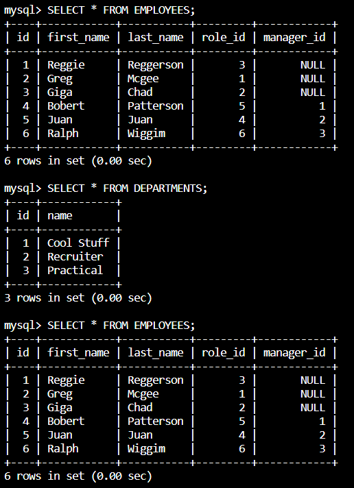

# 12 SQL: Employee Tracker

## Description 

Build a command-line application from scratch to manage a company's employee database, using Node.js, Inquirer, and MySQL. 

## Installation

MySQL
Node.js
Inquirer

## Mock-Up

The following video shows an example of the application being used from the command line:

[]

